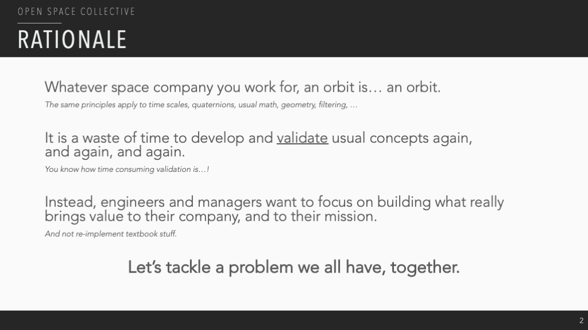
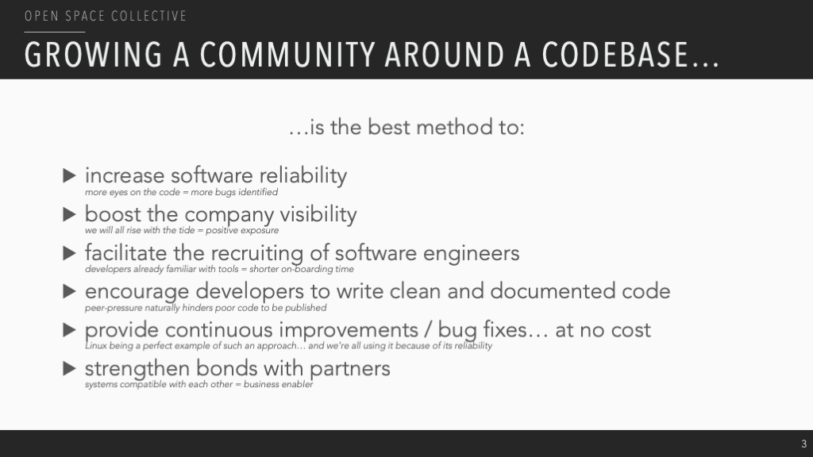
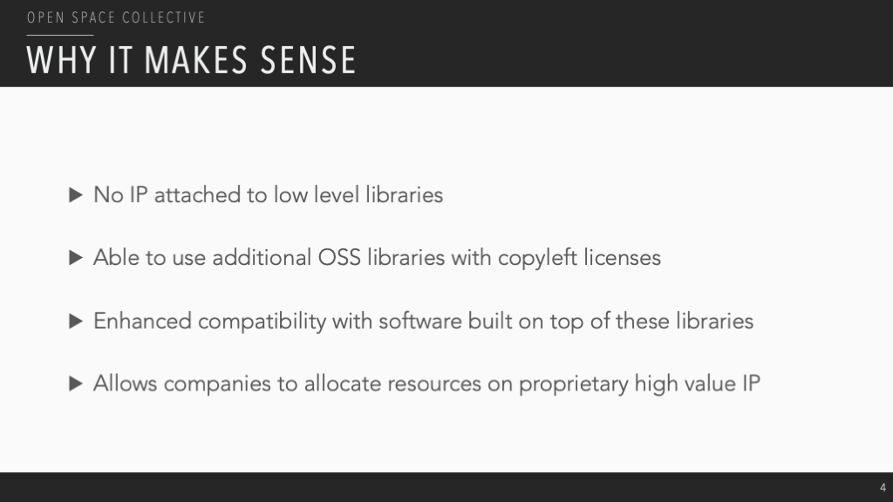
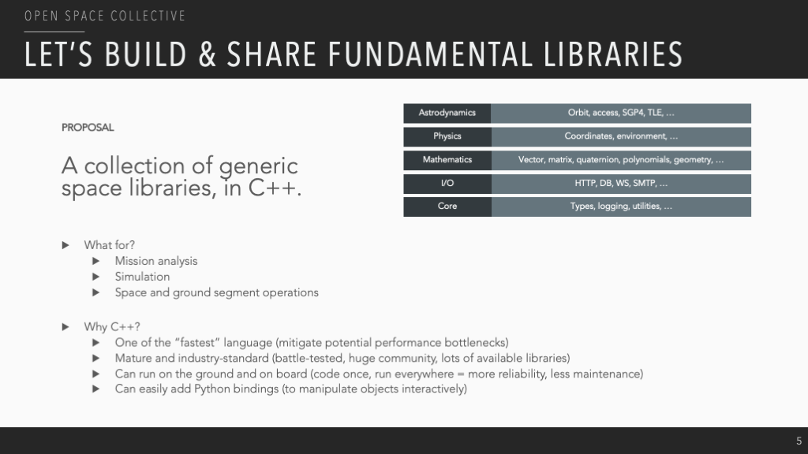
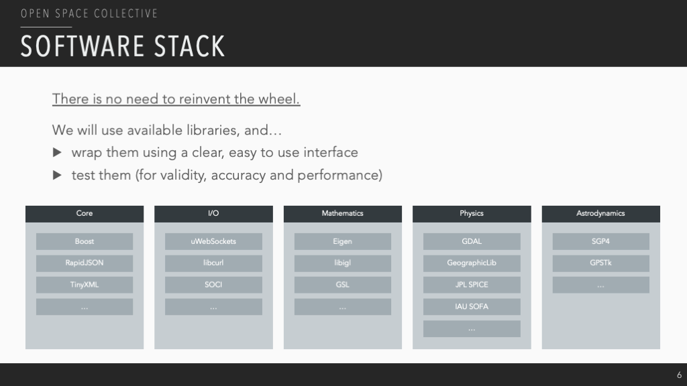

# Open Space Toolkit

## Warning

*⚠ Still under development.*

## Rationale

## Components

| Name          | Description                                                   | Link                                                                                                          |
| ------------- | ------------------------------------------------------------- | ------------------------------------------------------------------------------------------------------------- |
| Core          | Fundamental types, containers and utilities.                  | [open-space-toolkit-core](https://github.com/open-space-collective/open-space-toolkit-core)                   |
| I/O           | Addressing, networking, database connectors.                  | [open-space-toolkit-io](https://github.com/open-space-collective/open-space-toolkit-io)                       |
| Mathematics   | Geometry, curve fitting, optimization.                        | [open-space-toolkit-mathematics](https://github.com/open-space-collective/open-space-toolkit-mathematics)     |
| Physics       | Physical units, time, reference frames, environment modeling. | [open-space-toolkit-physics](https://github.com/open-space-collective/open-space-toolkit-physics)             |
| Astrodynamics | Orbit, attitude, access.                                      | [open-space-toolkit-astrodynamics](https://github.com/open-space-collective/open-space-toolkit-astrodynamics) |

## Use Cases

Check out some use-cases [here](./docs/Use%20Cases.md)!

## FAQ

*To be completed...*

## Contributing

Contributions are more than welcome!

Please read our [contributing guide](CONTRIBUTING.md) to learn about our development process, how to propose bugfixes and improvements, and how to build and test the code.

## Code of Conduct

*To be completed...*

## Special Thanks

*To be completed...*

## License

Apache License 2.0
