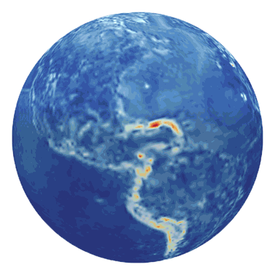

# Open Space Toolkit

The Open Space Toolkit (**OSTk**) is a collection of versatile libraries for aerospace engineering use, available in:

- **C++** – the reference implementation, for portability and performance.
- **Python** – via C++ bindings, formidable for interactive use and prototyping.

## Getting Started

Want to get started? This is the simplest and quickest way:

*This will automatically start a [JupyterLab](https://jupyterlab.readthedocs.io/en/stable/) environment in your web browser with Open Space Toolkit libraries and example notebooks ready to use. Nothing to download or install! 🚀*

## Components

| Name                                                                                       | Description                                                   | Version                                                                                                                                                                                      |
| ------------------------------------------------------------------------------------------ | ------------------------------------------------------------- | -------------------------------------------------------------------------------------------------------------------------------------------------------------------------------------------- |
| [Core](https://github.com/open-space-collective/open-space-toolkit-core)                   | Fundamental types, containers and utilities.                  |                    |
| [I/O](https://github.com/open-space-collective/open-space-toolkit-io)                      | Addressing, networking, database connectors.                  |                        |
| [Mathematics](https://github.com/open-space-collective/open-space-toolkit-mathematics)     | Geometry, curve fitting, optimization.                        |      |
| [Physics](https://github.com/open-space-collective/open-space-toolkit-physics)             | Physical units, time, reference frames, environment modeling. |              |
| [Astrodynamics](https://github.com/open-space-collective/open-space-toolkit-astrodynamics) | Orbit, attitude, access.                                      |  |

## Support

- [Use Cases](./docs/Use%20Cases.md)
- [Frequently Asked Questions](./docs/FAQ.md)
- [Discussion Channels](https://gitter.im/open-space-collective/community)

## Contributing

Contributions are more than welcome!

Please read our [contributing guide](CONTRIBUTING.md) to learn about our development process, how to propose bugfixes and improvements, and how to build and test the code.

## Special Thanks

## License

Apache License 2.0
